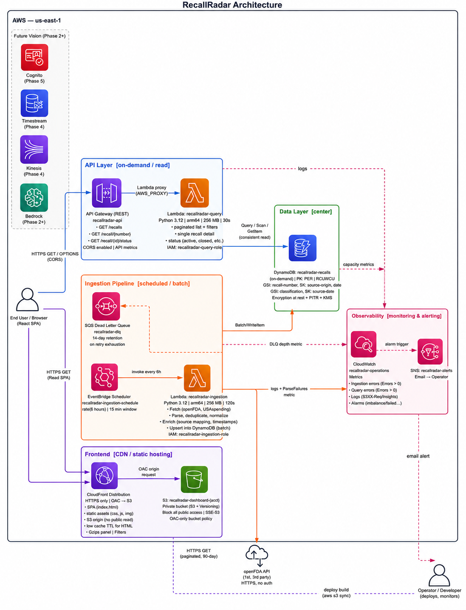

# RecallRadar — Real-Time FDA Recall Intelligence

A personal serverless project that ingests FDA food recall data from openFDA, maps geographic impact across the United States, and surfaces insights about recall severity, frequency, and trends that nobody else aggregates in one place.


## 📋 Table of Contents

- [Overview](#-overview)
- [Architecture](#️-architecture)
- [Features](#-features)
- [Configuration](#️-configuration)
- [Usage](#-usage)
- [Project Structure](#-project-structure)
- [Key Design Decisions](#-key-design-decisions)
- [Cost](#-cost)
- [Future Improvements](#-future-improvements)
- [Data Source](#-data-source)

## 🎯 Overview

RecallRadar started as a passion project to answer a simple question: when the FDA publishes a food recall, where does it actually land, and how serious is it? Public recall notices are scattered across FDA pages and raw API dumps. I wanted a single view — an interactive map, a live feed, and aggregate stats — updated automatically without babysitting a server.

The stack is fully serverless on AWS: scheduled Lambda ingestion, DynamoDB storage, a REST API, and a React dashboard behind CloudFront. Terraform manages all infrastructure. It runs in my personal AWS account in `us-east-1` and costs roughly **$3/month**.

### Workflow

1. **Scheduled ingestion** — EventBridge Scheduler invokes the ingestion Lambda every 6 hours.
2. **openFDA fetch** — The Lambda paginates through the [openFDA food enforcement API](https://open.fda.gov/apis/food/enforcement/) for recalls within a 90-day lookback window.
3. **Normalize and parse** — Each record is normalized to a DynamoDB item. The free-text `distribution_pattern` field is parsed into structured `affected_states` and an `is_nationwide` flag.
4. **Idempotent storage** — Records are keyed by FDA `recall_number`. Re-running ingestion overwrites existing items — no duplicates.
5. **Query API** — API Gateway routes GET requests to the query Lambda, which reads from DynamoDB with GSI-backed queries or scans.
6. **Dashboard** — A React app on CloudFront calls the API from the browser. The map colors states by recall volume; clicking a state filters the feed.
7. **Monitoring** — A CloudWatch dashboard tracks Lambda invocations, errors, duration, DynamoDB capacity, API 5xx, and DLQ depth. SNS alarms fire on ingestion errors and DLQ messages.

## 🏗️ Architecture



```
EventBridge Scheduler (every 6 hours)
        │
        ▼
┌─────────────────────────┐
│  Ingestion Lambda       │──────▶ openFDA API
│  (Python 3.12)          │       (food/enforcement)
│                         │
│  • Fetches new recalls  │
│  • Parses states from   │
│    distribution_pattern │
│  • Deduplicates by      │
│    recall_number        │
└─────────────────────────┘
        │
        ▼
┌─────────────────────────┐
│  DynamoDB               │
│  recallradar-recalls    │
│                         │
│  PK: recall_number      │
│  GSI: classification,   │
│       source, status    │
└─────────────────────────┘
        ▲
        │
┌─────────────────────────┐
│  Query Lambda           │
│  (Python 3.12)          │
│                         │
│  • Filter by class,     │
│    state, date range    │
│  • Pagination           │
│  • Aggregation stats    │
└─────────────────────────┘
        ▲
        │
┌─────────────────────────┐
│  API Gateway (REST)     │
│                         │
│  GET /recalls           │
│  GET /recalls/stats     │
│  GET /recalls/{id}      │
│                         │
│  API key required       │
└─────────────────────────┘
        ▲
        │
┌─────────────────────────┐       ┌──────────────────────┐
│  CloudFront CDN         │◀──────│  S3 Bucket           │
│  /api/* → API Gateway   │       │  (React build files)  │
│                         │       │                      │
└─────────────────────────┘       └──────────────────────┘
```

### Data Flow

1. **EventBridge Scheduler** triggers the ingestion Lambda on a 6-hour cadence (with a 15-minute flexible window). Failed invocations land in an SQS dead-letter queue.
2. **Ingestion Lambda** fetches recall records from openFDA, parses geographic distribution from free-text fields, and writes normalized items to DynamoDB. Individual write failures are logged without aborting the batch.
3. **Query Lambda** serves filtered recall lists and aggregate stats from DynamoDB via API Gateway.
4. **CloudFront** serves the React dashboard from a private S3 bucket using Origin Access Control.

### Components

- **Ingestion Lambda** — Polls openFDA, parses state distribution, writes to DynamoDB
- **Query Lambda** — Filters, paginates, and aggregates recall data for the API
- **DynamoDB** — Primary store keyed by `recall_number` with GSIs for classification, source, and status
- **API Gateway** — REST endpoints for recalls list, stats, and single-recall lookup
- **CloudFront + S3** — Hosts the React dashboard with a private bucket policy
- **EventBridge Scheduler** — Drives periodic ingestion
- **CloudWatch + SNS** — Operational dashboard and email alarms

## ✨ Features

- 🗺️ **Interactive US map** — States color-coded by recall volume; click to filter the feed
- 📋 **Live recall feed** — Severity badges, firm names, product descriptions, and distribution details
- 📊 **Stats panel** — Total active recalls, classification breakdown, and top recalling firms
- 🔍 **Multi-axis filtering** — Filter by state, FDA classification, and recall status
- 🔄 **Automated ingestion** — Scheduled polling of openFDA with idempotent deduplication
- 📍 **State parsing** — Regex extraction of affected states from free-text distribution patterns
- 🔔 **Operational monitoring** — CloudWatch dashboard and SNS alarms for ingestion failures

## ⚙️ Configuration

Key Terraform variables in `terraform/variables.tf`:

| Variable | Description | Default |
|----------|-------------|---------|
| `aws_region` | AWS region for all resources | `us-east-1` |
| `table_name` | DynamoDB table name | `recallradar-recalls` |
| `ingestion_lookback_days` | Days of recall history to fetch from openFDA | `90` |
| `ingestion_schedule_expression` | How often ingestion runs | `rate(6 hours)` |
| `api_stage_name` | API Gateway deployment stage | `v1` |
| `alarm_email` | SNS email for CloudWatch alarms | `""` |

## 📖 Usage

Ingestion runs automatically every 6 hours via EventBridge Scheduler — no manual intervention needed under normal operation.

The dashboard is served from CloudFront and calls the API Gateway endpoints directly from the browser. The map, feed, and stats panel update on each page load and filter interaction.

API endpoint details are documented in [`docs/API.md`](./docs/API.md).

## 📁 Project Structure

```
RecallRadar/
├── lambda/
│   ├── ingestion/          # openFDA → DynamoDB ingestion handler
│   ├── query/              # API query handler
│   ├── shared/             # State parsing + geocoding constants
│   └── tests/              # Unit tests for state parsing
├── dashboard/
│   ├── src/components/     # RecallMap, RecallFeed, StatsPanel, FilterBar
│   └── src/App.js          # Main dashboard layout
├── terraform/
│   ├── main.tf
│   ├── variables.tf
│   └── modules/
│       ├── recalls_table/
│       ├── ingestion_lambda/
│       ├── ingestion_scheduler/
│       ├── query_lambda/
│       ├── api_gateway/
│       ├── dashboard_hosting/
│       └── monitoring/
├── scripts/
│   └── deploy-dashboard.sh # Build and sync dashboard to S3 + CloudFront
├── docs/
│   └── API.md              # REST API reference
├── images/                 # Architecture diagram and screenshots
└── README.md
```

## 💡 Key Design Decisions

| Decision | Why |
|----------|-----|
| `recall_number` as DynamoDB PK | Natural idempotency — re-running ingestion never creates duplicates. Same pattern as stateful deduplication in production alert systems. |
| On-demand DynamoDB capacity | Write pattern is bursty (batch after each API poll) with long idle periods between. Provisioned capacity would waste money on a system that writes once every 6 hours. |
| 6-hour polling instead of continuous | openFDA updates weekly. Polling every 15 min = 672 invocations to catch 1 update. 6 hours = 28 invocations. Operational efficiency over aggressive freshness. |
| OAC over public S3 bucket | CloudFront Origin Access Control keeps the S3 bucket private. The dashboard is served through the CDN only — no public bucket policy. |
| State parsing as a Python function, not Bedrock | `distribution_pattern` has limited patterns — regex handles 95% of cases. Calling Bedrock for string parsing at ingestion time adds cost and latency that isn't justified. AI enrichment targets higher-value analysis like risk scoring. |
| Scan for stats endpoint (Phase 1) | Full table scan is acceptable when the table has < 30K items and the stats endpoint is called infrequently. DynamoDB Streams + precomputed aggregations replace this before scale matters. |

## 💰 Cost

Phase 1 runs for approximately **$3/month** — mostly CloudWatch dashboard and alarms. Lambda, DynamoDB, API Gateway, EventBridge, S3, and CloudFront stay within free tier at typical usage.

| Service | Usage | Monthly cost |
|---------|-------|--------------|
| Lambda (ingestion + query) | ~120 + ~1000 invocations | Free tier |
| DynamoDB (on-demand) | ~30K items | Free tier |
| API Gateway | ~1000 requests | Free tier |
| EventBridge Scheduler | 4 invocations/day | Free tier |
| S3 + CloudFront | Static dashboard | ~$0.01 |
| CloudWatch | Dashboard + 2 alarms | ~$3.00 |

## 🔮 Future Improvements

Planned extensions that layer on top of Phase 1 without refactoring the core pipeline:

- **Phase 2 — AI enrichment** — Bedrock analyzes `reason_for_recall` for plain-English risk summaries and severity scores
- **Phase 3 — Multi-source** — CPSC, NHTSA, and USDA adapters using the same ingestion pattern
- **User subscriptions** — Cognito auth + SNS/SES alerts when recalls match user location and allergen profile
- **Predictive analytics** — Correlate recall patterns with FDA inspection data
- **Real-time feed** — WebSocket API for live dashboard updates without polling

## 📡 Data Source

Recall data comes from the [openFDA food enforcement API](https://open.fda.gov/apis/food/enforcement/). FDA classifications:

- **Class I** — Dangerous or defective product that could cause serious health problems or death
- **Class II** — Product may cause temporary or medically reversible health problems
- **Class III** — Product unlikely to cause adverse health consequences
